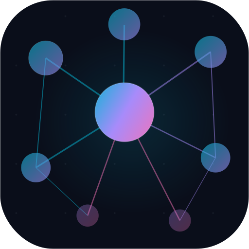

# Graphn

<p align="center">
  
</p>

<p align="center">
  <strong>Node Relation Mapper</strong> — brainstorm, cluster, and see what matters most.
</p>

<p align="center">
  <a href="https://node-mapper.vercel.app/">https://node-mapper.vercel.app/</a>
</p>

---

An interactive graph visualization tool where importance emerges naturally from connections. Create nodes, connect them with directed edges, and the visual hierarchy builds itself — bigger nodes, bolder colors, thicker edges for what's most connected.

## Features

- **Automatic visual importance** — Node size, color, label size, glow intensity, and edge thickness all scale with connection count. No manual styling needed.
- **Color palettes** — 5 colormaps (Default, Ocean, Warm, Pastel, Neon) that map degree to color like matplotlib.
- **Constellation mode** — Ambient animation with gentle node vibration, pulsing glow, and looping background music. Three tracks included.
- **Infinite canvas** — Pan and zoom with no boundaries. Dot grid background.
- **Graph statistics** — Live stats panel showing node/edge counts, most connected nodes, and degree breakdown.
- **Export / Import** — Save and load workspaces as JSON. Palette and preferences included.
- **Dark / Light theme** — Observatory-inspired dark theme by default.
- **Help & Credits** — Built-in dialog with keyboard shortcuts, features, and music credits.

## Getting Started

```bash
npm install
npm run dev
```

Open `http://localhost:5173` in your browser.

## Usage

| Action | How |
|---|---|
| Create node | Double-click empty canvas |
| Move node | Drag it |
| Select node | Click it |
| Edit node | Double-click it |
| Delete node | Select, click X button |
| Add relation | Select node, click + button |
| Edit relation | Double-click the edge |
| Delete relation | Click edge, click X button |
| Pan canvas | Drag empty area or middle-click drag |
| Zoom | Scroll wheel |
| Fit all nodes | Fit button in toolbar |
| Constellation mode | Play button in toolbar |
| Switch music | Music note button next to play |
| Switch palette | Color dots button in toolbar |

## Build

```bash
npm run build     # Production build to dist/
npm run preview   # Preview the production build
```

## Tech Stack

- [Svelte 5](https://svelte.dev/) — Reactive UI framework
- [Vite](https://vitejs.dev/) — Build tool with HMR
- SVG-based rendering with viewBox pan/zoom
- DM Sans + JetBrains Mono typography

## Music Credits

All tracks from [pixabay.com](https://pixabay.com) (free license):

| Track | Author |
|---|---|
| Space Ambient Cinematic | Delosound |
| Meditation | Prettyjohn1 |
| Ambient Space Background | Universfield |

## Recommended IDE

[VS Code](https://code.visualstudio.com/) + [Svelte extension](https://marketplace.visualstudio.com/items?itemName=svelte.svelte-vscode)
